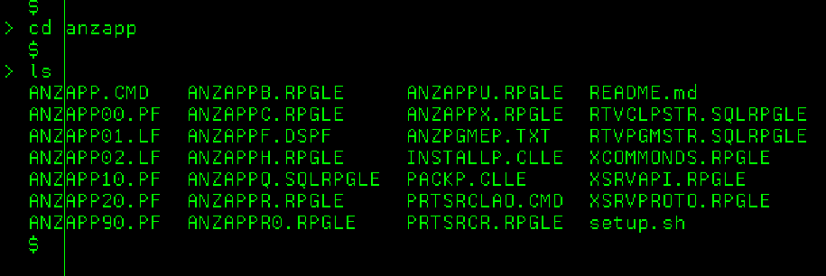
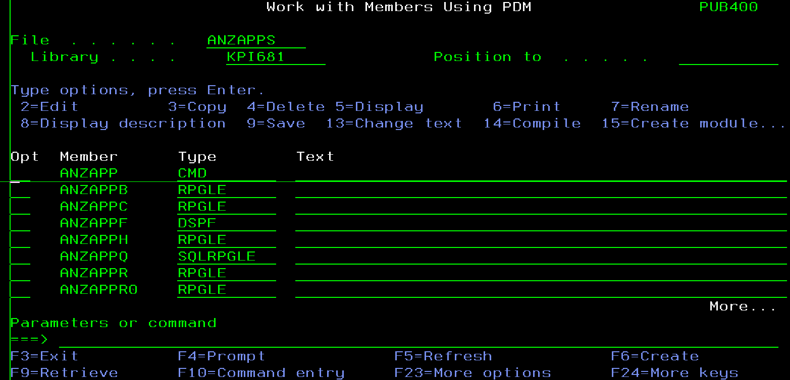
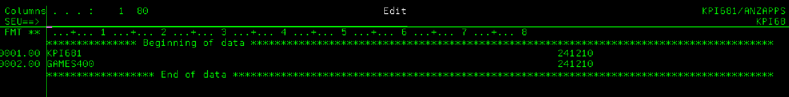
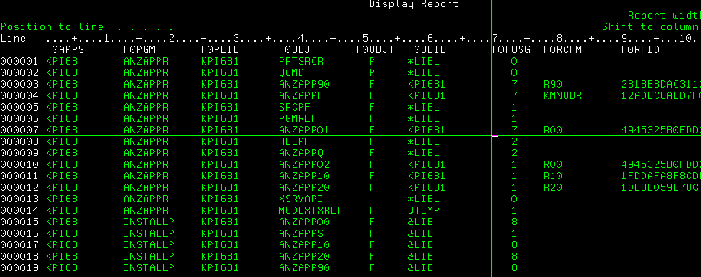
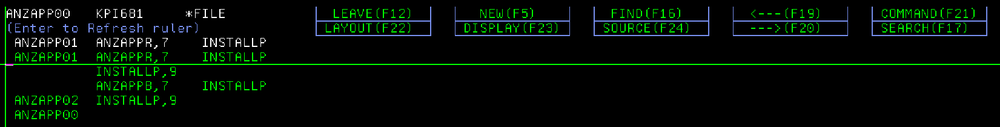
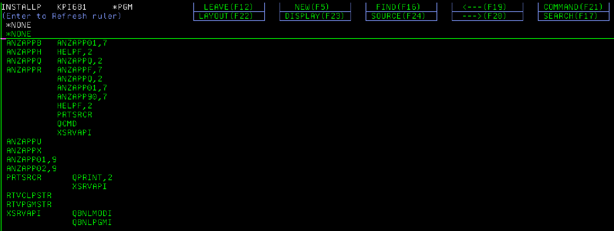

# ANZAPP
Application Analyzer on iSeries

This utility allows cascaded linkage between objects to show on screen, from where one can read source code of a program or module.

## Install
Once the package is cloned as a IFS folder under the user's home (~), or downloaded in zip then transmitted into an IFS folder, we are ready. For example, my home repo: /home/KPI68/ANZAPP.



```
sh setup.sh [TARGET_LIBRARY] [SOURCE_DIRECTORY]
```
For example, sh setup.sh KPI681 /home/KPI68/ANZAPP
will set the source physical file ANZAPPS in library KPI681. Obviously, the file ANZAPPS should NOT pre-exist in KPI681 or else the step fails.



Next use option 14 to compile INSTALLP from the source member. Then
```
call installp [library]
```
where the [library] would be the same as the source. "ANZAPP utility successfully installed." will show.

## Use
To use the utility, type command ANZAPP on the command line.

### Build the cross-reference
Now is time to generate the cross-reference for your application, by simply providing the object libraries where programs, modules, files, etc. reside. Under the File tab, select New or Renew. Type a name for your cross-reference then input the libraries in the subsequence SEU, one per line.



When asked "Sure?" reply YES. The job ANZAPP is then submitted to build the cross-references, which are stored in file ANZAPP00. It looks like this:



### Use the cross-reference

File/Open to open a cross-reference. Once opened it will stay opened next time, till another cross-reference is opened. 

X-ref/Obj Linked can be used from any object to link upwards; X-ref/Obj Refered can be used from a program to display all objects it refers directly or indirectly via other programs. Example:

Linked:


Refered:


While we are at it, we can also select a program and read the source (refer to the function keys listed); or if no selection, the root object is selected by default.

# PS - use SSH for GitHub at QSH
(Tip: Change job's CCSID to 37 for special characters such as @, ~ to display properly, though the display does not affect usage.)

### Generate pair of keys
```
ssh-keygen -t rsa -b 4096 -C "kpi68@www.pub400.com"
```
This will generate id_rsa and id_rsa.pub in ~/.ssh. Copy the whole content of the .pub to paste at GitHub SSH key.

### Define hosts
In ~/.ssh/config, define host names:
```
Host github.com                 
    HostName github.com         
    User git                    
    Port 22                     
    IdentityFile ~/.ssh/id_rsa  
    IdentitiesOnly yes          
Host pub400                     
    HostName www.pub400.com     
    User kpi68                  
    Port 2222                   
    IdentityFile ~/.ssh/id_rsa  
    IdentitiesOnly yes          
```
### Config profile to automate SSH and git

In ~/.profile:
```
# .profile                                             
                                                       
# Add /QOpenSys/pkgs/bin to the PATH                   
export PATH=/QOpenSys/pkgs/bin:$PATH                   
                                                       
# Other environment variables and settings can go here 
eval "$(ssh-agent -s)"                                 
ssh-add ~/.ssh/id_rsa                                  
ssh -vT git@github.com                    
```
### Restart QSH
Should see 
```
Hi KPI68! You've successfully authenticated, but GitHub does not provide shell access  
```
Now we can clone GitHub repository using SSH; add, commit, and push, pull changes.  


